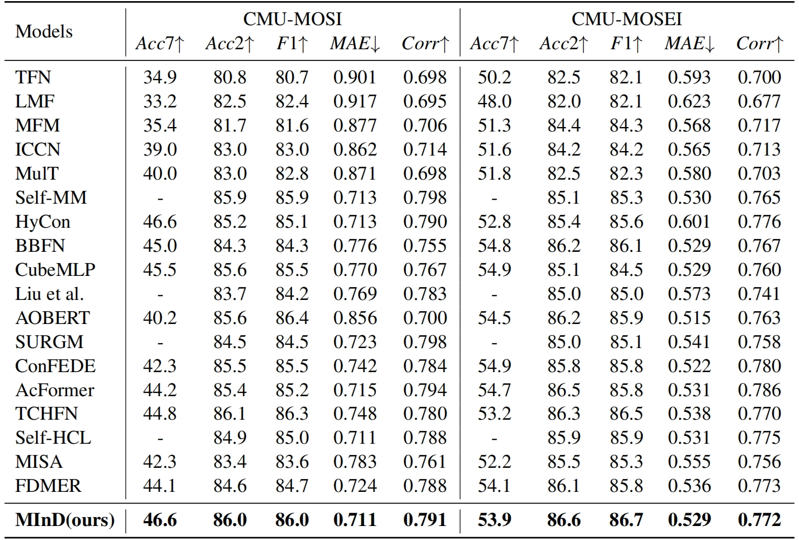
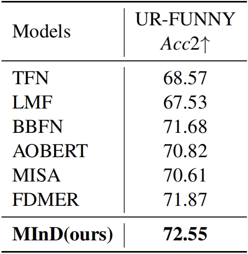
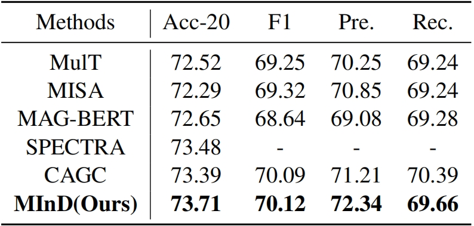

# MInD

Code for MInD: Multimodal Information Disentanglement, will be made **fully** available after the paper is published.

Feel free to discuss any details with me at any time :)

## Experiments

While some methods may stand out when evaluated by specific metric on one dataset, 
only MInD exhibits consistently competitive performance across all datasets under all metrics.

### MOSI & MOSEI



### UR-FUNNY

Note that we use **UR-FUNNY Version 1** here.



### MIntRec



## Citation

```
@article{dai2024mind,
  title={MInD: Improving Multimodal Sentiment Analysis via Multimodal Information Disentanglement},
  author={Dai, Weichen and Li, Xingyu and Hu, Pengbo and Wang, Zeyu and Qi, Ji and Peng, Jianlin and Zhou, Yi},
  journal={arXiv preprint arXiv:2401.11818},
  year={2024}
}
```